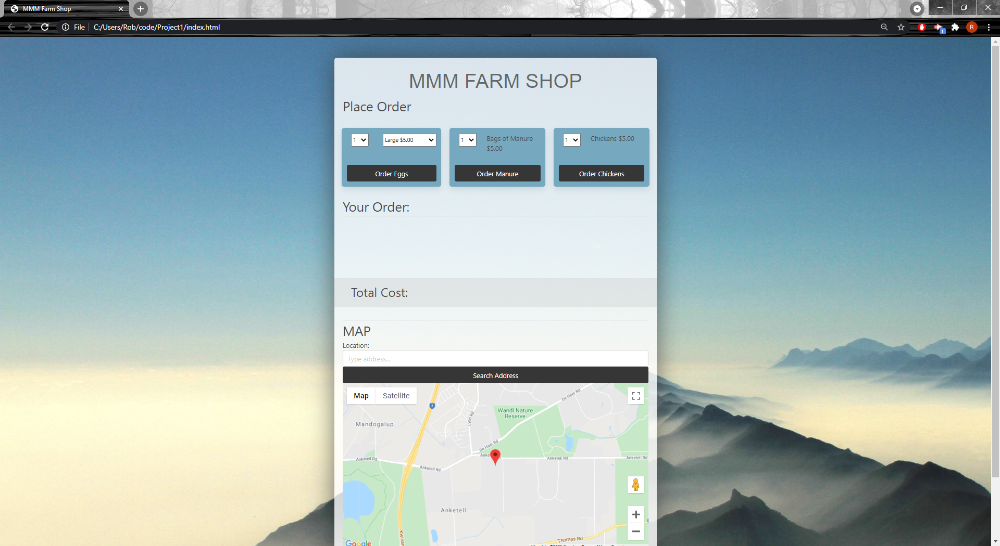

## TRIPLE M FARM APP

# Robert Rousset, Jeric Fernando & Teddy Kasa 

For this project we set out to make a functioning shop for MMM Farm. This app included an option to select products, the capability to calculate how long it would take a customer to get to the farm and the ability to send that information as an email to the staff. 

We first set out by selecting our CSS framework, which ended up being bulma. We selected this based on a few articles that had said it had an easy learning curve and was quite popular. After only a few moments of tinkering and reading the documentation this framework was indeed very easy to understand and use, as it used very similar syntax to base CSS. 

After getting the general layout of the page (which went through a few itterations), it was then time to start on the javascript. We started easy by having the select product options display below in the "view order" area after clicking the "submit" buttons. This was done with simple creation of elements and then appending them to the desired area. Calculating the totals was a little harder as the different egg sizes were in the same select menu, and it was hard to create a Math.floor(function) for each particular select option. This was solved with a few if statements that checked if the select option matched the desired value, and then applying a bit of multiplication for each price. 

After we went onto the google maps API which was probably the hardest concept for us to wrap our heads around. It didn't work like the other fetch(requests) that we were used to, and instead worked in a way where you had to assign a variable to a google.maps object, which then had many different functions like Map, Marker, InfoWindow and so on. This was unintuitive at first but became easier to understand the more we used it, and then eventually was quite a good efficient way of using the API. For the geocoder API we used the fetch(request) method as we only wanted the co-ordinates (latitude and longitude) that we could create a marker for, and feed into the directions API to get the time travelled info. Using the directionsService is where the Google Maps API became a little more understood and we ended up leaving the directionsRender until another release as we were getting low on time. 

To configure the email took a little while to set up. Most API's seemed to only work through node.js and it was hard to find one that was on our level of understanding. The API we chose (smtpJS) was an easy to understand service and let you create an smtp to send emails through and only required a few lines of code to call the function. This then lead to selecting all the javascript created elements, and sending them all in the body so that the staff knew excatly what the order was, and what time they were expected.

This project took a lot of communication and colaboration. It taught us a lot about the use of GitHub in a team and making sure that we worked together at the same times to help each other and not have any commit issues etc. We worked well as a team and allowed everyones voice to be heard and there was never a hindering dispute among members. 

Heres the link to our deployed application: https://robert-rousset.github.io/MMM-Farm-App/

Api's we used:  Google Maps API (Geocoder, Directions API and the Google maps library: Places.) all for location and time of arrival.

SmtpJS for sending emails.

